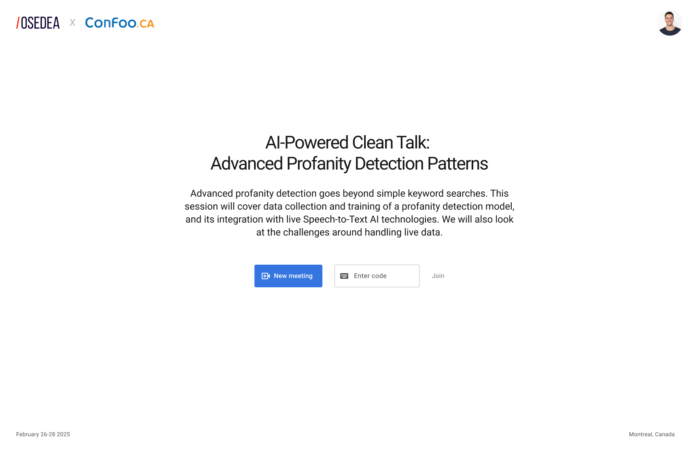
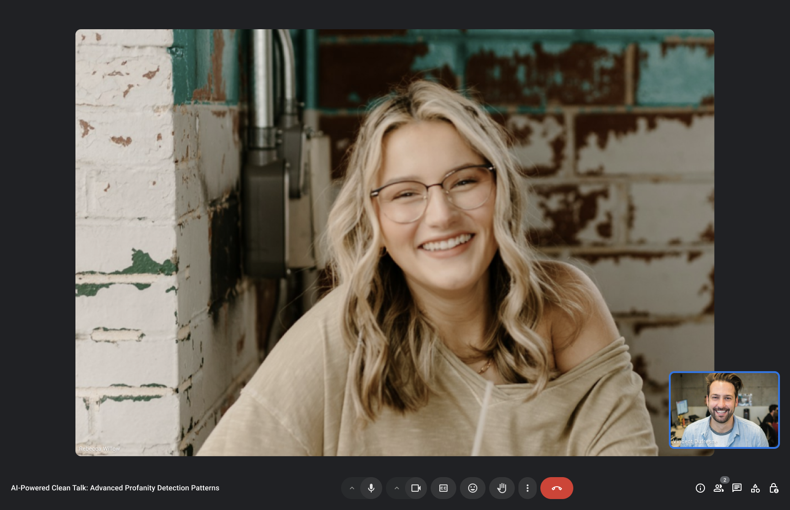
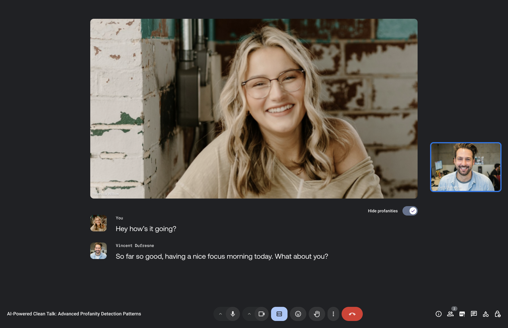
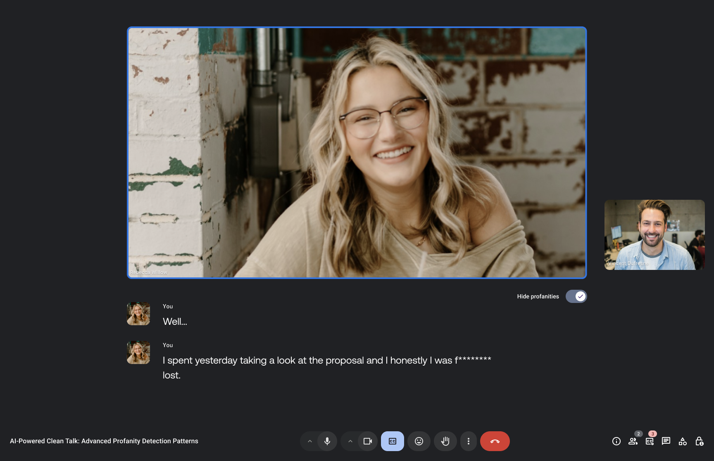
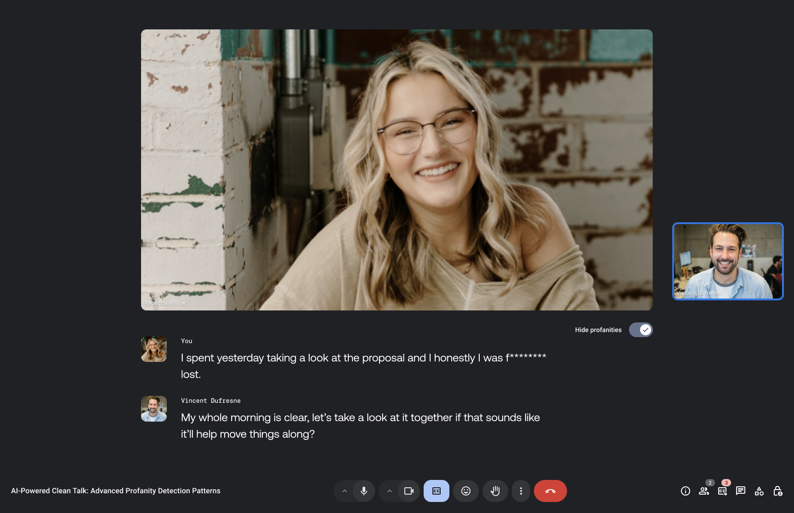
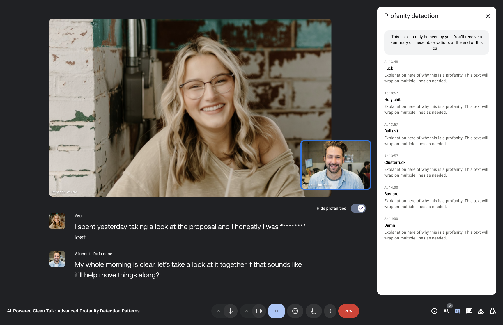
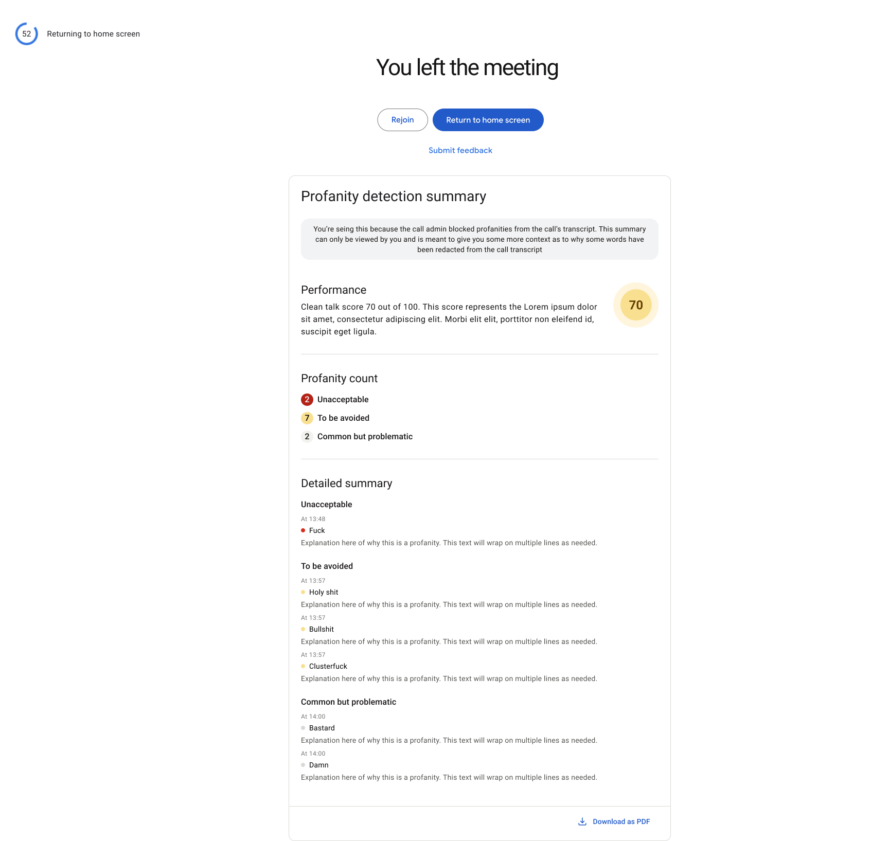
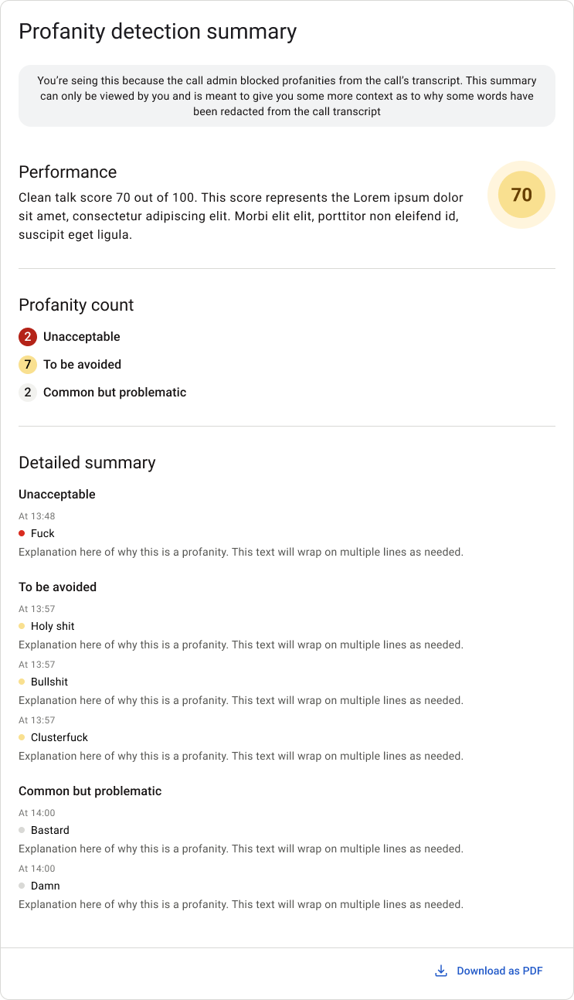

# Design

The design of the application was developed by [Osedea](https://osedea.com) and is heavily inspired by the design of [Google Meet](https://meet.google.com/).

The objective of the design is to augment the user experience by providing a live transcript with a summary of the conversation and the censored words.

## User Interface

The user interface is composed of the following elements:

- A landing page that allows the user to create a new room or join an existing one
- A video page that displays the video chat and the transcript
- A end page that displays the summary of the conversation and the censored words

The design is for full screen first.

### Home page

### Video page

Video page without transcription:

Admin can enable the transcription:

Admin can enable profanity filter:

Transcription displayed:

Profanity detected:

List of profanity:

### Summary page

End page with summary of the profanities:

End modal with explanation and score:

